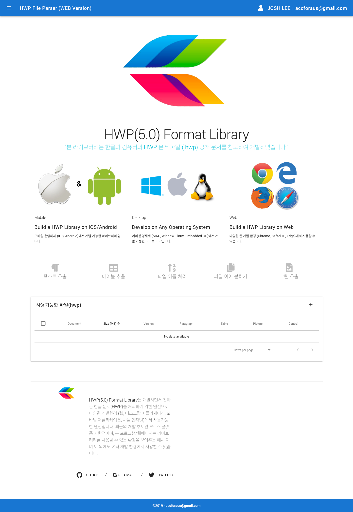

# libhwp-web

이 프로젝트는 [libhwp]()와 [libhwp-server]()을 이용하여 만든 간단한 한글 파일 리더기 입니다.

> Developed by Vue.js & Vuetify
## Screen Shots



## Build Setup

``` bash
# install dependencies
npm install

# serve with hot reload at localhost:8080
npm run dev

# build for production with minification
npm run build

# build for production and view the bundle analyzer report
npm run build --report
```

## Services

- `Text Extraction` - extract normal text in selected file
- `Table Extraction` - extract table in selected file
- `File Name Management` - manage name in multiple selected files
- `File Attachment` - attach multiple selected files
- `Image Extraction` - extract images in selected file
